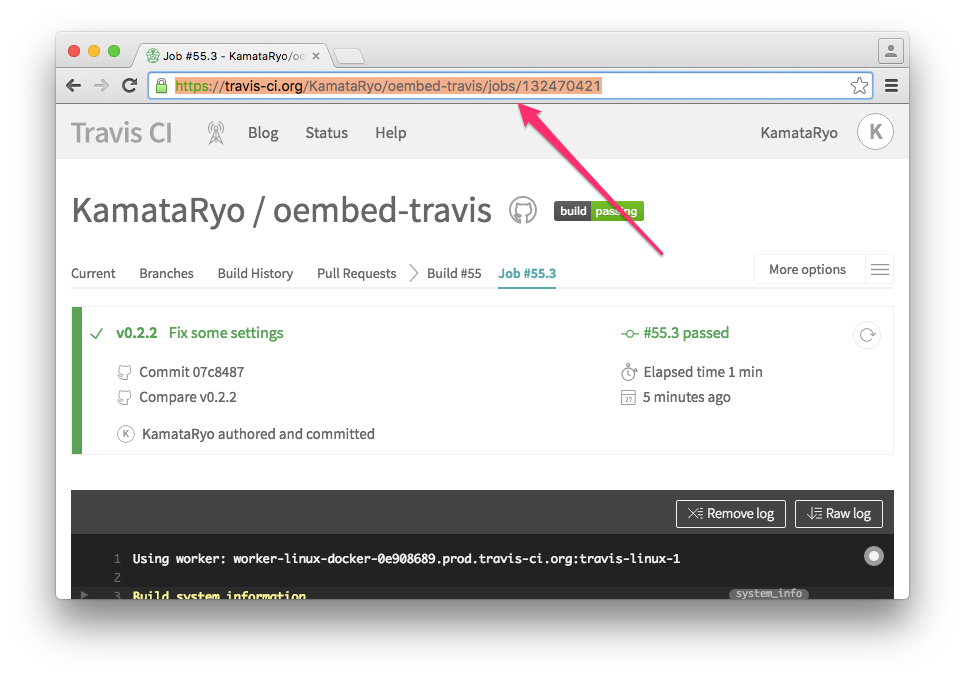
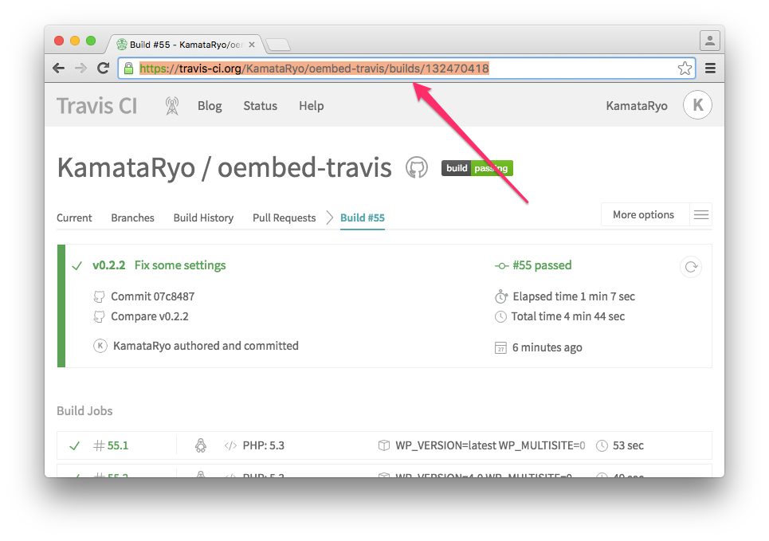
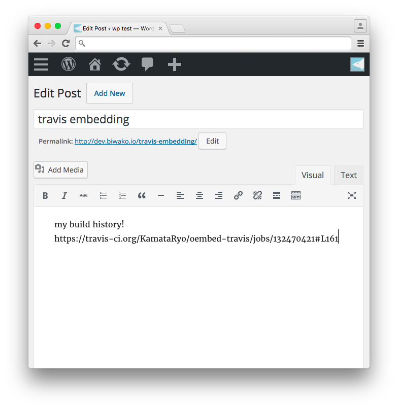
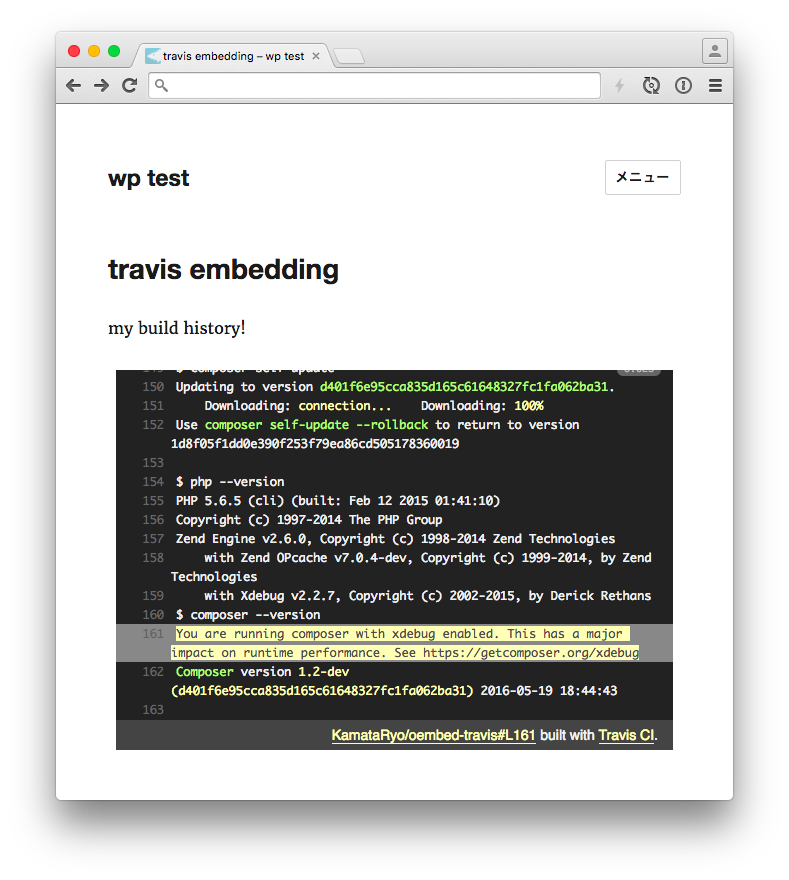

# oEmbed Travis

[](https://travis-ci.org/KamataRyo/oembed-travis)
[](https://wordpress.org/plugins/oembed-travis/)
[](https://styleci.io/repos/58851332)

## Official Repository

https://wordpress.org/plugins/oembed-travis/

## Contributing

```
$ git clone https://github.com/KamataRyo/oembed-travis
$ cd oembed-travis
$ bash bin/install-wp-tests.sh wordpress_test root '' localhost $WP_VERSION
$ phpunit
$ npm install
$ npm test
```

## Screen shots

1. copy jobs url


1. or copy build urls


1. paste on editor


1. build log appears in your post!


## Acknowledgments

This plugin is based on [oEmbed Gist](https://wordpress.org/plugins/oembed-gist/) authored by [@miya0001](https://github.com/miya0001). I would like to express my gratitude and appreciation to the great plugin and its developmental fixtures.
